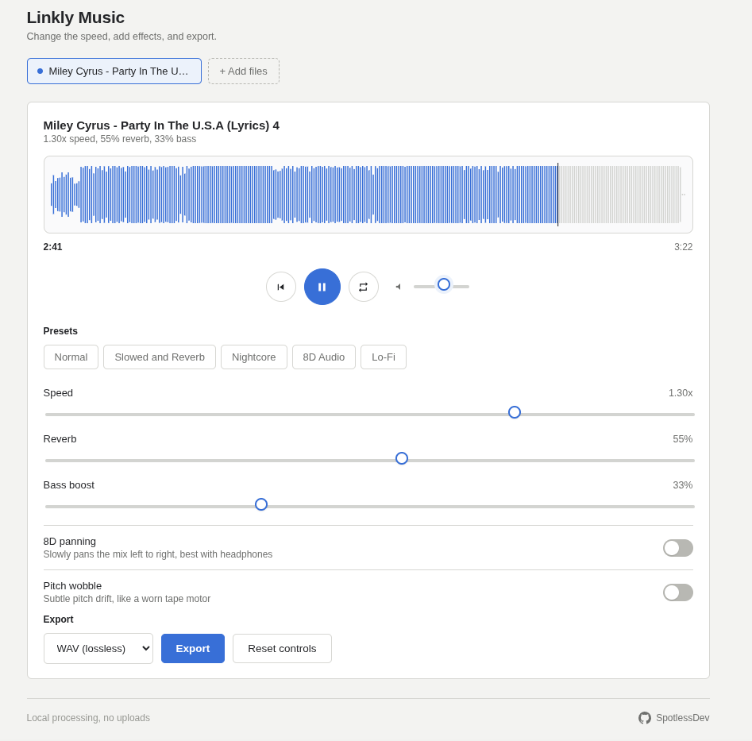

# Linkly Music

  

A lightweight, browser-based audio editing and remixing tool. Adjust speed, apply reverb, boost bass, toggle 8D panning, and export your audio directly from your browser. 

No audio files are ever uploaded to a server—everything is processed locally on your device.

---

## Features

- **Local Processing:** Audio stays inside your browser for full privacy and instant speeds.
- **Playback & Speed Control:** Change playback speed smoothly from 0.5x to 1.6x.
- **Audio Effects:** 
  - Adjustable Reverb
  - Bass Boost
  - 8D Panning (spatial audio panning for headphones)
  - Pitch Wobble (tape-style motor drift)
- **Presets:** Quick-select setups for Normal, Slowed and Reverb, Nightcore, 8D Audio, and Lo-Fi.
- **Interactive Waveform:** Seek and scrub through tracks directly on the visual waveform display.
- **Export Formats:** Download your remixed tracks in lossless **WAV** or **MP3 (320 kbps)** formats.

---

## Getting Started

No installation or build steps required.

1. Clone or download this repository.
2. Open `index.html` in any modern web browser.
3. Drag and drop an audio file onto the page or click **+ Add files** to begin editing.

---

## License

Distributed under the MIT License. See `LICENSE` for details.

Developed by [SpotlessDev](https://github.com/SpotlessDev).
